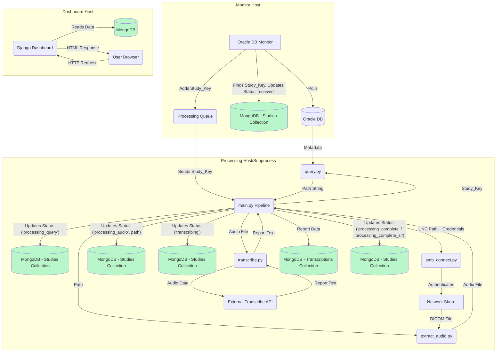
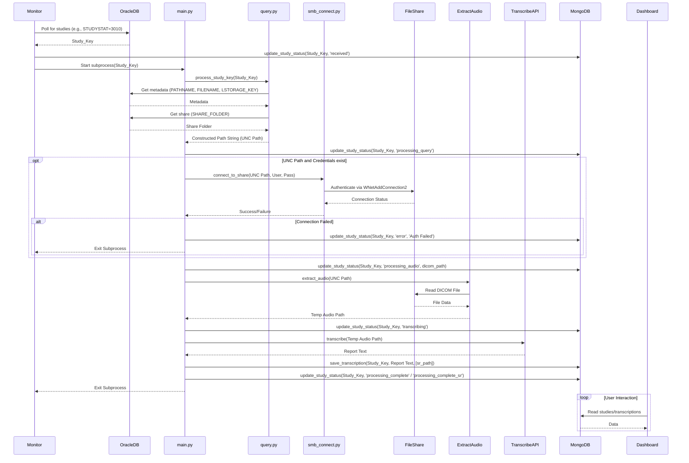

# System Architecture

## Overview

This system automates the process of transcribing medical dictations associated with DICOM studies. It monitors an Oracle database for new studies, retrieves associated DICOM audio data (potentially from authenticated network shares), uses an external service (like Google Gemini) for transcription, stores the status and results in a MongoDB database, and provides a Django-based web dashboard for monitoring progress.

## Key Components

1.  **Oracle Database Monitor (`modules/database_monitor.py`)**
    *   Polls an Oracle table (e.g., `TREPORT`) for studies requiring transcription.
    *   When a new study (`STUDY_KEY`) is detected, it updates the study's status to `received` in the MongoDB `studies` collection via `database_operations`.
    *   Adds the `STUDY_KEY` to an internal queue.
    *   Launches the main processing pipeline (`main.py <STUDY_KEY>`) as a subprocess for each key in the queue.

2.  **Path Query (`modules/query.py`)**
    *   Receives a `STUDY_KEY`.
    *   Connects to the Oracle database to retrieve metadata associated with the study (e.g., `REPORT_KEY`, `PATHNAME`, `FILENAME`, `LSTORAGE_KEY`).
    *   Queries storage configuration (e.g., `TSTORAGE`) to find the base share path (`SHARE_FOLDER`).
    *   Constructs the full, potential DICOM file path (often a UNC path like `\\server\share\pathname\filename`) **without verifying its existence**.
    *   Returns the constructed path string.

3.  **Network Share Connector (`modules/smb_connect.py`)**
    *   Receives a UNC path and credentials (from `config.yaml`).
    *   Uses `pywin32` (`WNetAddConnection2`) to establish an authenticated connection to the network share root (`\\server\share`) if the path is a UNC path and credentials are provided.
    *   Handles cases where connections already exist or credentials fail.

4.  **Core Processing Pipeline (`main.py` - `run_pipeline` function)**
    *   Orchestrates the transcription process for a single `STUDY_KEY`.
    *   Calls `query.process_study_key` to get the potential DICOM path.
    *   Updates study status in MongoDB (`processing_query`, `processing_audio`, `transcribing`, etc.) via `database_operations`.
    *   If the path is UNC, calls `smb_connect.connect_to_share` to authenticate.
    *   Calls `extract_audio.extract_audio` to read the DICOM file (using the authenticated connection if applicable) and save a temporary audio file.
    *   Calls `transcribe.transcribe` to send the audio to the external transcription service.
    *   If transcription is successful:
        *   Calls `database_operations.save_transcription` to store the report text in the MongoDB `transcriptions` collection.
        *   Updates study status to `processing_complete` (or `processing_complete_sr` if SR encapsulation is enabled) in MongoDB.
    *   Handles errors, updating the study status to `error` in MongoDB with details.
    *   Cleans up temporary files.

5.  **Audio Extraction (`modules/extract_audio.py`)**
    *   Takes the DICOM file path.
    *   Reads the DICOM file (requires file system access, leveraging the connection established by `smb_connect` if applicable).
    *   Extracts the audio stream.
    *   Saves the audio to a temporary file format (e.g., WAV).
    *   Returns the path to the temporary audio file.

6.  **Transcription (`modules/transcribe.py`)**
    *   Takes the temporary audio file path.
    *   Connects to the configured external transcription service (e.g., Google Gemini API, using API keys from `config.yaml`).
    *   Sends the audio data for transcription.
    *   Receives the transcribed text report.
    *   Returns the report (e.g., as a string or list of strings).

7.  **MongoDB Operations (`modules/database_operations.py`)**
    *   Provides functions to interact with the MongoDB database.
    *   Handles connecting to the database using settings from `config.yaml`.
    *   `update_study_status`: Creates or updates records in the `studies` collection (tracking `study_key`, `status` [e.g., 'received', 'processing_query', 'processing_audio', 'transcribing', 'processing_complete', 'processing_complete_sr', 'error'], `timestamps`, `dicom_path`, `error_message`).
    *   `save_transcription`: Inserts records into the `transcriptions` collection (linking to `study_key`, storing `report_text`, `timestamp`, `sr_path`).

8.  **MongoDB Database**
    *   Stores the application state and results.
    *   `studies` collection: Tracks the processing status of each study.
    *   `transcriptions` collection: Stores the resulting reports.

9.  **Django Web Dashboard (`dashboard/`)**
    *   A separate web application built using the Django framework.
    *   Connects to the MongoDB database (via `djongo` and `database_operations`).
    *   Provides views (`study_dashboard/views.py`) to display data from the `studies` and `transcriptions` collections.
    *   Uses templates (`study_dashboard/templates/`) to render HTML pages showing the status list and details for each study.
    *   Includes a Django Admin interface (`study_dashboard/admin.py`) for low-level data viewing and management.
    *   Runs as a separate process using `python manage.py runserver` (for development).

## Technical Stack

| Layer                 | Technologies                                    | Config Source   |
|-----------------------|-------------------------------------------------|-----------------|
| **Runtime**           | Python 3.11, Conda                              | environment.yml |
| **Core Service**      | `oracledb`, `pywin32`                           | config.yaml     |
| **Database**          | MongoDB                                         | config.yaml     |
| **DB Connectors**     | `pymongo`                                       | environment.yml |
| **Web Dashboard**     | Django, `djongo`                                | environment.yml, config.yaml |
| **AI Processing**     | Google Gemini (or other via `transcribe.py`)    | config.yaml     |
| **Medical Imaging**   | `pydicom` (likely used in `extract_audio.py`)   | DICOM Standard  |
| **Build (Optional)**  | PyInstaller                                     | audio_transcriber.spec |

## Data Flow Diagram

*Simplified - Multiple updates to MongoDB shown separately for clarity.*

## Sequence Diagram (Simplified Pipeline Focus)

## Security Considerations

*   **Credentials:**
    *   `config.yaml` contains sensitive credentials (Oracle DB, MongoDB URI, Share user/pass, API keys, Django secret key). Access to this file should be strictly controlled.
    *   Consider using environment variables or a dedicated secrets management system instead of storing plain text credentials in `config.yaml` for production environments.
*   **Network Shares:** Ensure the user account specified in `SHARE_USERNAME` has the minimum necessary permissions (read-only if possible) on the network share.
*   **MongoDB:** Configure MongoDB authentication and network access controls appropriately.
*   **Django Dashboard:** Follow Django security best practices (HTTPS, CSRF protection, secure session management, `DEBUG=False` in production).
*   **PHI:** Review the transcription service's handling of Protected Health Information (PHI). Ensure redaction or appropriate agreements (BAA) are in place if necessary.

## Cross References
- [Installation Guide](installation.md)
- [Configuration Reference](config_reference.md)
- [Module Documentation](../modules/main.md)
- [Readme](../readme.md)