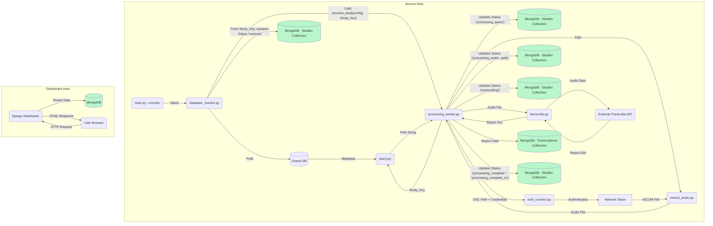
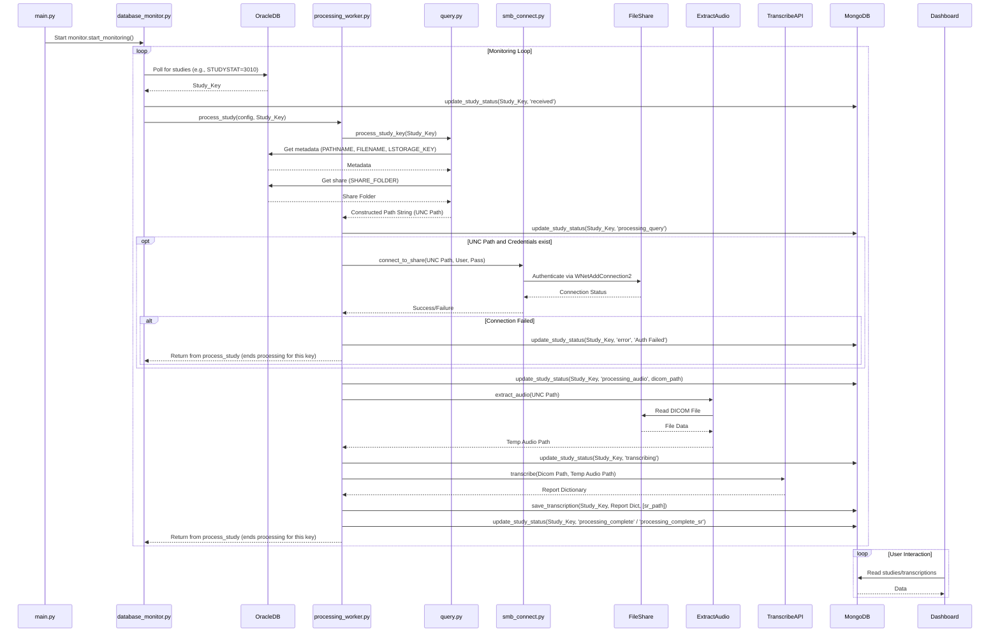

# System Architecture

## Overview

This system automates the process of transcribing medical dictations associated with DICOM studies. It monitors an Oracle database for new studies, retrieves associated DICOM audio data (potentially from authenticated network shares), uses an external service (like Google Gemini) for transcription, stores the status and results in a MongoDB database, and provides a Django-based web dashboard for monitoring progress.

## Key Components

1.  **Main Application (`main.py`)**
    *   Entry point for the service, launched via `python main.py --monitor`.
    *   Loads configuration (`config.yaml`), initializes logging.
    *   Instantiates and starts the `DatabaseMonitor`.

2.  **Oracle Database Monitor (`modules/database_monitor.py`)**
    *   Polls an Oracle table (e.g., `TSTUDY`) for studies requiring transcription (e.g., `STUDYSTAT=3010`).
    *   When a new `STUDY_KEY` is detected, it updates the study's status to `received` in the MongoDB `studies` collection via `database_operations`.
    *   Directly calls `processing_worker.process_study(config, study_key)` to initiate the pipeline for that study.
    *   Waits for the `process_study` call to complete before continuing the polling loop.

3.  **Processing Worker (`modules/processing_worker.py`)**
    *   Contains the `process_study(config, study_key)` function, which orchestrates the transcription process for a single study.
    *   Calls `query.process_study_key` to get the potential DICOM path from Oracle.
    *   Updates study status in MongoDB (`processing_query`, `processing_audio`, `transcribing`, etc.) via `database_operations`.
    *   If the path is UNC, calls `smb_connect.connect_to_share` to authenticate.
    *   Calls `extract_audio.extract_audio` to read the DICOM file and save a temporary audio file.
    *   Calls `transcribe.transcribe` to send the audio to the external transcription service.
    *   If transcription is successful:
        *   Calls `database_operations.save_transcription` to store the report text/dictionary in the MongoDB `transcriptions` collection.
        *   Updates study status to `processing_complete` (or `processing_complete_sr` if SR encapsulation is enabled) in MongoDB.
    *   Handles errors, updating the study status to `error` in MongoDB with details.
    *   Cleans up temporary files.

4.  **Path Query (`modules/query.py`)**
    *   Receives a `STUDY_KEY`.
    *   Connects to the Oracle database to retrieve metadata associated with the study.
    *   Constructs the full, potential DICOM file path.
    *   Returns the constructed path string.

5.  **Network Share Connector (`modules/smb_connect.py`)**
    *   Receives a UNC path and credentials.
    *   Uses `pywin32` to establish an authenticated connection to the network share.

6.  **Audio Extraction (`modules/extract_audio.py`)**
    *   Takes the DICOM file path.
    *   Reads the DICOM file, extracts the audio stream, saves it to a temporary file.
    *   Returns the path to the temporary audio file.

7.  **Transcription (`modules/transcribe.py`)**
    *   Takes the DICOM path and temporary audio file path.
    *   Connects to the external transcription service (e.g., Google Gemini API).
    *   Sends the audio, receives the report (as a dictionary).
    *   Returns the report dictionary or `None`.

8.  **MongoDB Operations (`modules/database_operations.py`)**
    *   Provides functions (`update_study_status`, `save_transcription`) to interact with MongoDB collections (`studies`, `transcriptions`).

9.  **MongoDB Database**
    *   Stores application state (`studies`) and results (`transcriptions`).

10. **Django Web Dashboard (`dashboard/`)**
    *   Separate web application connecting to MongoDB.
    *   Displays study status and transcription results.
    *   Runs as a separate process (`python manage.py runserver`).

## Technical Stack

| Layer                 | Technologies                                    | Config Source   |
|-----------------------|-------------------------------------------------|-----------------|
| **Runtime**           | Python 3.11, Conda                              | environment.yml |
| **Core Service**      | `oracledb`, `pywin32`                           | config.yaml     |
| **Database**          | MongoDB                                         | config.yaml     |
| **DB Connectors**     | `pymongo`                                       | environment.yml |
| **Web Dashboard**     | Django, `djongo`                                | environment.yml, config.yaml |
| **AI Processing**     | Google Gemini (or other via `transcribe.py`)    | config.yaml     |
| **Medical Imaging**   | `pydicom` (likely used in `extract_audio.py`)   | DICOM Standard  |
| **Build (Optional)**  | PyInstaller                                     | audio_transcriber.spec |

## Data Flow Diagram

*Simplified - Multiple updates to MongoDB shown separately for clarity.*

## Sequence Diagram (Simplified Pipeline Focus)

## Security Considerations

*   **Credentials:**
    *   `config.yaml` contains sensitive credentials. Access control is crucial.
    *   Consider alternatives like environment variables or secrets management for production.
*   **Network Shares:** Use least privilege principles for the `SHARE_USERNAME` account.
*   **MongoDB:** Configure authentication and network controls.
*   **Django Dashboard:** Follow Django security best practices.
*   **PHI:** Review transcription service handling of PHI.

## Cross References
- [Installation Guide](installation.md)
- [Configuration Reference](config_reference.md)
- [Module Documentation](../modules/main.md)
- [Readme](../readme.md)