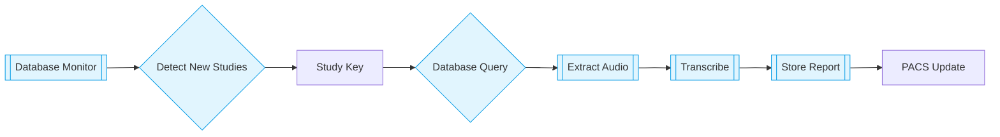

# System Architecture

## Overview
A distributed medical transcription system that converts DICOM audio dictations into structured reports. Integrates with PACS databases and leverages Google's Gemini AI for medical speech-to-text conversion.

## Key Components

### Core Processing Pipeline


### Component Breakdown

1. **Database Monitor**
   - Polls TREPORT table every 60 seconds
   - Manages study processing queue
   - Self-reloading architecture for EXE/script modes

2. **Processing Pipeline**
   ```python
   def run_pipeline(study_key):
       path = process_study_key()  
       audio = extract_audio()     
       report = transcribe()       
       store_results()            
   ```

3. **Error Handling**
   - Multi-layer retry logic
   - Database connection resiliency
   - Temporary file cleanup mechanisms

## Technical Stack

| Layer              | Technologies                          | Config Source                          |
|---------------------|---------------------------------------|----------------------------------------|
| **Runtime**         | Python 3.11, Oracle Instant Client    | environment.yml |
| **AI Processing**   | Google Gemini 2.0 Flash              | config.yaml |
| **Medical Imaging** | pydicom, pynetdicom                   | DICOM Standard Compliance              |
| **Security**        | Oracle Advanced Security, Cryptography| environment.yml |

## Data Flow
1. **Input**: Study Key via CLI/Monitor
2. **Processing**:
   ```mermaid
   sequenceDiagram
       Database->>+Query: STUDY_KEY
       Query->>+Extract: DICOM path
       Extract->>+Transcribe: WAV audio
       Transcribe->>+Store: JSON report
       Store->>Database: Commit transaction
   ```
3. **Output**: Updated TREPORT table entries

## Deployment Architecture
```bash
                          +-----------------+
                          |  Oracle Server  |
                          +--------+--------+
                                   |
                          +--------v--------+
                          | Database Monitor|
                          +--------+--------+
                                   |
+------------+            +--------v--------+          +---------------+
| DICOM Node +----------->| Processing EXE  +--------->| PACS Database |
+------------+            +-----------------+          +---------------+
```

## Security Considerations
- PHI Redaction in Transcribe
- Encrypted database credentials
- Audit trails for report modifications

## Cross References
- [Installation Guide](installation.md)
- [Configuration Reference](../config/config_reference.md)
- [Module Documentation](../modules/main.md)