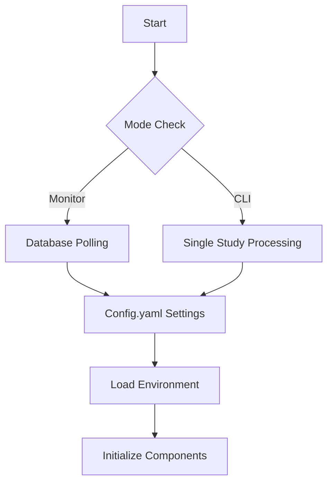

# Configuration Reference

## Environment Setup (`environment.yml`)
```yaml
name: google-ai
channels:
  - defaults
  - conda-forge
dependencies:
  - python=3.11
  - oracledb=2.5.1    # Oracle DB connectivity
  - pip:
      - google-generativeai  # Core AI integration
      - pydicom             # DICOM processing
      - pynetdicom         # DICOM network ops
      - numpy              # Audio processing
      - cryptography       # Security functions
      - pywin32            # Windows integration
```

## Runtime Configuration (`config.yaml`)
```yaml
# AI Services
GEMINI_API_KEY: "your_api_key"
MODEL_NAME: "gemini-2.0-flash"  # Options: ["gemini-2.0-flash-lite", "gemini-2.0-flash"]

# Database Connectivity
ORACLE_HOST: "172.31.100.60" # for example
ORACLE_PORT: 1521
ORACLE_SERVICE_NAME: "persiangulf"
ORACLE_USERNAME: "dodeulbyeol"
ORACLE_PASSWORD: "secure_password"

# Operational Modes (From <mcsymbol name="run_pipeline" filename="main.py" path="e:\SRwithenhancedSOP\main.py" startline="113" type="function"></mcsymbol>)
ENCAPSULATE_TEXT_AS_ENHANCED_SR: "OFF"  # Enable SR DICOM generation
STORE_TRANSCRIBED_REPORT: "ON"          # Auto-commit to database
PRINT_GEMINI_OUTPUT: "ON"               # Debugging output

# Monitoring (From <mcsymbol name="DatabaseMonitor" filename="main.py" path="e:\SRwithenhancedSOP\main.py" startline="35" type="class"></mcsymbol>)
poll_interval: 60  # Seconds between DB checks

# Security
LONGTERM_USERNAME: "persiangulfadmin"
LONGTERM_PASSWORD: "secure_password"

# Logging Configuration
LOGGING_LEVELS:
  basic: "INFO"     # Console output
  detailed: "DEBUG" # File logging
  error: "ERROR"    # Error alerts
```

## Configuration Parameters Table

| Section         | Key                            | Purpose                                                                 | Valid Values              |
|-----------------|--------------------------------|-------------------------------------------------------------------------|---------------------------|
| AI Services     | GEMINI_API_KEY                 | Authentication for Google AI services                                  | Valid API key string      |
| Database        | ORACLE_SERVICE_NAME           | Target database instance identifier                                    | TNS service name          |
| Operational     | ENCAPSULATE_TEXT_AS_ENHANCED_SR | Controls DICOM SR generation                                          | "ON"/"OFF"                |
| Monitoring      | poll_interval                 | Frequency of database checks in monitor mode                          | 30-300 (seconds)          |
| Security        | LONGTERM_PASSWORD             | Credential for persistent storage access                               | Encrypted string          |

## Configuration Flow


## Related Documents
- [Installation Instructions](../high_level/installation.md)
- [Main Application Workflow](../modules/main.md)
```