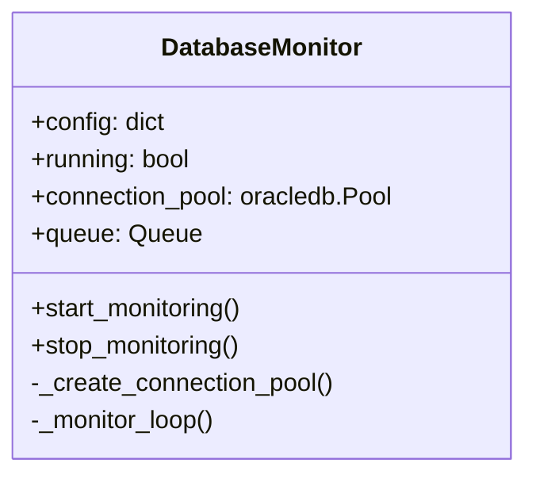

# Database Monitor Module

## Overview
Implements continuous monitoring of Oracle database for new studies. Core component of the system's automation capabilities.

## Key Features
- **Polling Mechanism**: Checks TREPORT table every 60 seconds
- **Queue Management**: Thread-safe processing queue for study keys
- **Dual Mode Operation**: Supports both executable and script modes

## Class Diagram

## Integration Points
- Initialized from main.py's --monitor flag
- Feeds study keys into processing pipeline
- Shared connection pool with query module

## Error Handling
- Automatic reconnection on database errors
- Graceful shutdown on KeyboardInterrupt
- Connection pool validation checks

[Back to Module Index](main.md)