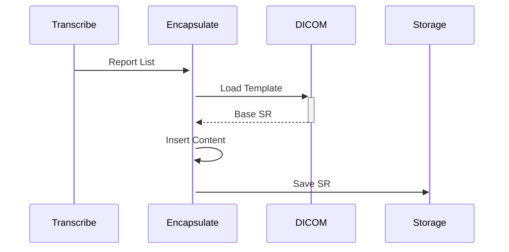

# Encapsulate Text as Enhanced SR Module

## Overview
Transforms transcribed text into DICOM Structured Reports following CIOS Implementation Guide. Integrates with existing DICOM node infrastructure.

## Key Features
- **DICOM SR Generation**: Creates compliant SR objects
- **Context Preservation**: Maintains original study metadata
- **Configurable Templates**: Supports multiple report formats

## Sequence Diagram


## Configuration Reference
```yaml
ENCAPSULATE_TEXT_AS_ENHANCED_SR: "OFF"  # Enable/disable SR generation
SR_OUTPUT_FOLDER: "C:\\Path\\To\\SR"  # Output directory
```

## Integration Points
- Triggered after successful transcription
- Uses original DICOM file metadata
- Shares output directory with PACS integration

[Back to Module Index](main.md)