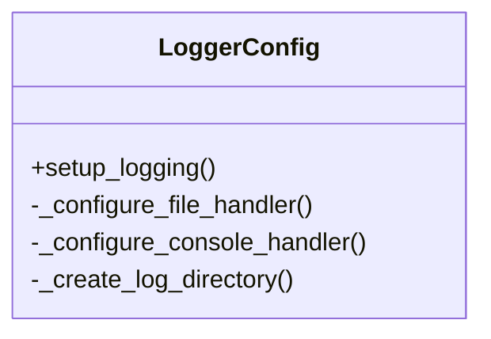

# Logger Configuration Module

## Overview
Centralized logging configuration for the entire application. Implements multi-level logging with file rotation and console output.

## Key Features
- **Hierarchical Configuration**: Separate basic/detailed/error logs
- **Rotation Policy**: 7 day retention with 10MB file limits
- **Format Consistency**: Standardized log message formatting

## Configuration Diagram


## Integration Points
- Initialized first in main.py
- Used by all modules through shared logging interface
- Configurable via config.yaml logging levels

## Example Configuration
```yaml
LOGGING_LEVELS:
  basic: "INFO"
  detailed: "DEBUG"
  error: "ERROR"
```

[Back to Module Index](main.md)