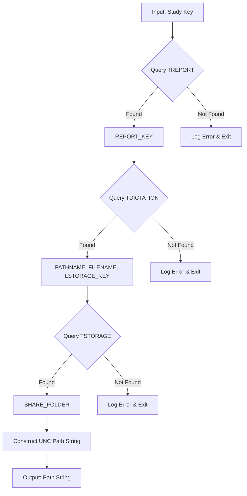

# Database Query Module (`query.py`)

## Purpose

This module is responsible for querying the Oracle database to determine the **potential** storage path of a DICOM file associated with a given `study_key`. It constructs the path string based on database records but **does not** access the file system or verify the path's existence.

## Main Function: `process_study_key(config, study_key)`

*   **Purpose:** Resolves a `study_key` to a potential physical file location string by querying multiple Oracle tables.
*   **Parameters:**
    *   `config` (dict): Application configuration, used for database connection details (`ORACLE_*` keys).
    *   `study_key` (str): Unique study identifier.
*   **Returns:**
    *   `str`: The constructed potential full path to the DICOM file (often a UNC path like `\\server\share\path\file.dcm`). Returns this string whether the file actually exists or not.
*   **Raises:**
    *   `oracledb.DatabaseError`: For database connection or query failures.
    *   `SystemExit`: If required records (e.g., in `TREPORT`, `TDICTATION`, `TSTORAGE`) are not found for the given keys, indicating a data inconsistency.
*   **Key Steps:**
    1.  Connects to the Oracle database using credentials from `config`.
    2.  Queries `TREPORT` using `study_key` to get `REPORT_KEY`.
    3.  Queries `TDICTATION` using `REPORT_KEY` to get `PATHNAME`, `FILENAME`, and `LSTORAGE_KEY`.
    4.  Queries `TSTORAGE` using `LSTORAGE_KEY` to get the `SHARE_FOLDER` name.
    5.  Constructs the `unc_root` using the `ORACLE_HOST` (assuming it's the file server) and `SHARE_FOLDER`.
    6.  Combines `unc_root`, `pathname`, and `filename` using `os.path.join`.
    7.  Normalizes the path using `os.path.abspath(os.path.normpath(...))`.
    8.  **Crucially, does NOT call `os.path.exists()` or similar file system checks.**
    9.  Logs the constructed path and returns it.
    10. Closes the database cursor and connection in a `finally` block.

## Query Chain Logic



## Configuration Requirements

Relies on the following keys in the `config` dictionary (typically loaded from `config.yaml`):

*   `ORACLE_HOST`
*   `ORACLE_PORT`
*   `ORACLE_SERVICE_NAME`
*   `ORACLE_USERNAME`
*   `ORACLE_PASSWORD`

## Error Handling

*   Handles missing database records by logging an error and calling `sys.exit(1)`. This assumes that missing records indicate a state where processing cannot continue.
*   Database connection/query errors are propagated as `oracledb.DatabaseError`.

## Dependencies

*   `oracledb`: For Oracle database access.
*   `os`: For path manipulation (`os.path.join`, `os.path.abspath`, `os.path.normpath`).
*   `logging`: For operational tracking.
*   `sys`: For exiting on critical data errors.

## Usage Example

```python
# Within main.py's run_pipeline function
try:
    potential_dicom_path = process_study_key(config, "STUDY_2024_12345")
    # Subsequent steps will authenticate (if needed) and then access potential_dicom_path
except Exception as e:
    logging.error(f"Failed to get path: {e}")
```

## Related Documents
- [System Architecture](../high_level/architecture.md)
- [Configuration Reference](../high_level/config_reference.md)
- [Main Workflow](main.md)
```